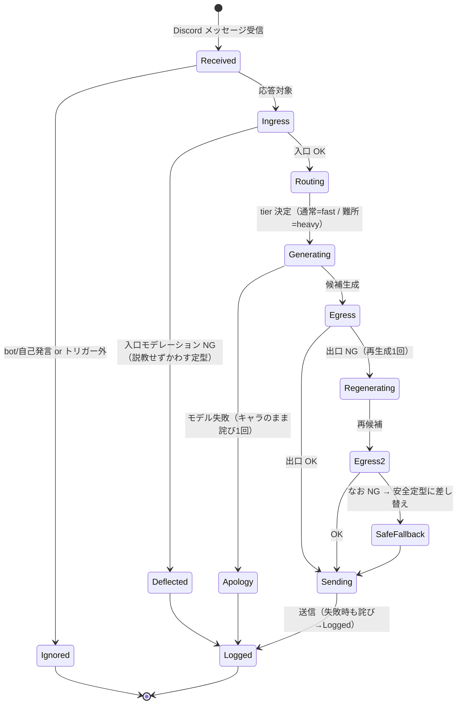
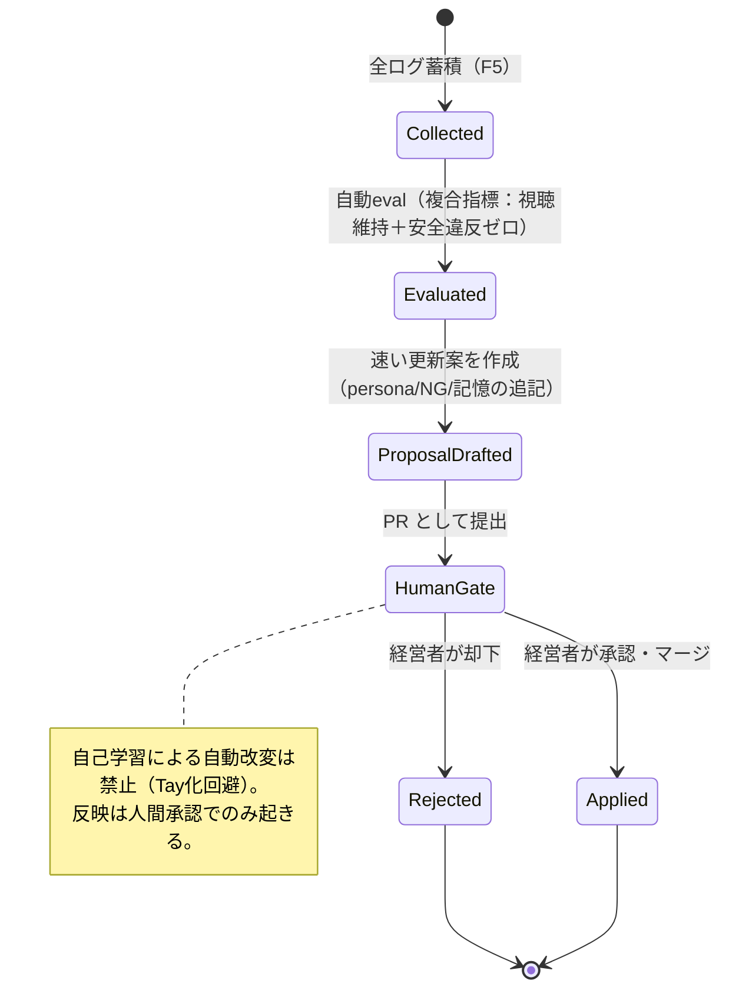

# L0-4 状態遷移（簡易モード, Mermaid のみ） — ヤジ

独自画面はないが、「リアルタイム経路」と「2速ループの遅い改善」にライフサイクルがある。
XState は使わず Mermaid で表現する（簡易モード）。

## 1. リアルタイム経路（1 メッセージの処理ライフサイクル）

HANDOFF §3.3 のテキスト経路に対応。Phase 0 では投げ銭分岐は「席のみ」で、実際には常に通常キューへ流れる。

注: 投げ銭最優先キュー（HANDOFF §3.3 / §5.7）は Phase 1。Phase 0 では `hasTip=false` 固定で通常キューのみ。
同時接続が増え通常キューが詰まる兆候が出たら ARC を realtime-pubsub へ移行する（REGIME.md ARC 注記）。

## 2. 遅い改善ループ（2速ループの「遅い」側・F6）

HANDOFF §3.1 に対応。**人間ゲート**を必ず通る。承認駆動の状態変化（S5）。

